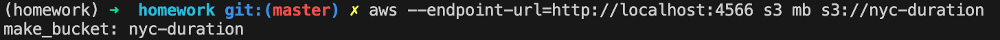
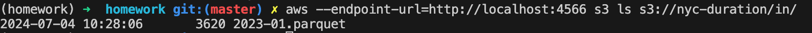

## Q1. Refactoring

Run the below command without setting variables `S3_ENDPOINT_URL`, `INPUT_FILE_PATTERN`, `OUTPUT_FILE_PATTERN``
 
```zsh
python batch.py 
```


## Q4. Mocking S3 with Localstack

```zsh
export S3_ENDPOINT_URL="http://localhost:4566"
```

```zsh
aws --endpoint-url=http://localhost:4566 configure 


WS Access Key ID [None]: test
AWS Secret Access Key [None]: test
Default region name [None]: eu-west-1
Default output format [None]: 


aws --endpoint-url=http://localhost:4566 s3 mb s3://nyc-duration
```

```zsh
aws --endpoint-url=http://localhost:4566 s3 ls s3://nyc-duration/
```




```zsh
export INPUT_FILE_PATTERN="s3://nyc-duration/in/{year:04d}-{month:02d}.parquet"
export OUTPUT_FILE_PATTERN="s3://nyc-duration/out/{year:04d}-{month:02d}.parquet"
```

## Q5. Creating test data

Create fake input data for integration test using `save_df_to_s3.py` script.



